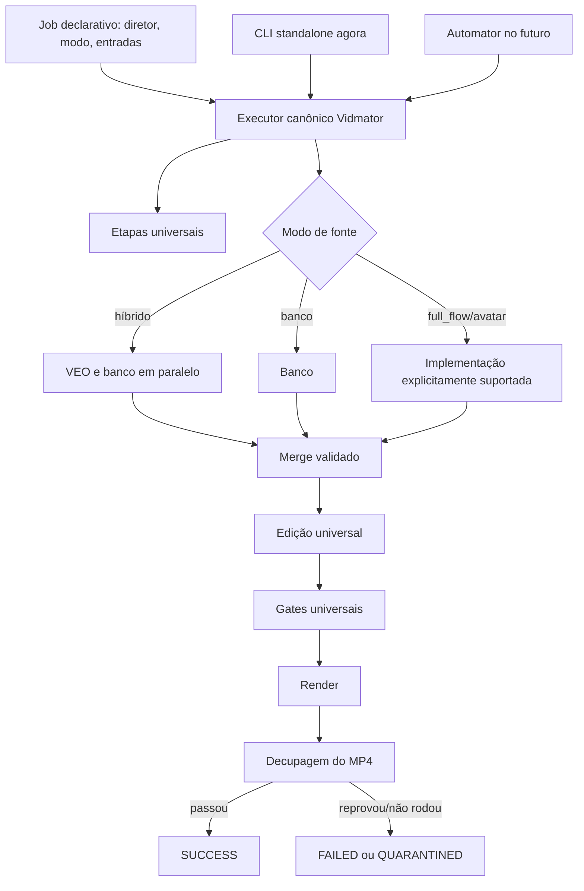

# ESPEC — execução canônica, retomável e mensurável do Vidmator

**Versão:** 1.0
**Data:** 13/08/2026
**Estado:** pronta para implementação; nenhum novo E2E real deve ser disparado antes dos gates desta espec
**Incidente-base:** `RELATORIO-E2E-LEOPARDO-13-08.md`
**Golden visual atual:** `_saida/leopardo_neves.mp4`
**Fonte única:** `director/golden/current.json`

## 1. Decisões já tomadas pelo operador

Estas decisões são requisitos, não sugestões:

1. O artefato visual de referência vigente é exatamente:
   `D:\AC Creator HUB\Vidmator\_saida\leopardo_neves.mp4`, conforme o ponteiro
   único `director/golden/current.json`. A Onça permanece fixture histórica.
2. O Vidmator será otimizado e validado **standalone** antes de ser ligado ao
   Automator. A integração com o Automator não faz parte desta rodada.
3. Cada minuto eliminado do executor standalone deve ser herdado pela futura
   produção oficial. O Automator deverá chamar o mesmo executor; não poderá copiar
   sua receita.
4. Quando uma etapa falhar, a execução deve parar num checkpoint seguro, preservar
   tudo que já foi validado e retomar apenas a etapa que falhou.
5. É proibido executar automaticamente uma receita antiga em série como fallback.
6. Qualidade, precisão dos elementos, dinamismo, reconciliação, fiscalização e
   portões finais pertencem à esteira universal. Diretor e modo de produção mudam
   decisões editoriais e fontes de material; não criam outra esteira de qualidade.
7. Um vídeo só termina como `SUCCESS` se o MP4 existir **e** a decupagem final passar.
   “Renderizou” não significa “aprovou”.

## 2. Objetivo

Construir um único caminho executável no Vidmator que:

- seja a única fonte de verdade da ordem das etapas;
- aceite condicionais explícitas (`full_flow`, `hibrido`, banco, avatar), sem
  duplicar a cadeia universal;
- grave checkpoint e manifesto de saída de cada etapa;
- retome sem repetir trabalho válido;
- contabilize tempo de parede, espera e retrabalho;
- preserve os invariantes aprovados no golden atual do Leopardo;
- mantenha a Onça apenas como fixture histórica de regressão;
- possa ser chamado pelo Automator no futuro sem tradução de receita.

Meta já declarada no canário da Onça: **E2E de vídeo de 6–8 minutos em até 60
minutos**, com meta de 30 minutos. A primeira obrigação desta rodada é remover
desperdício mensurável; a meta não autoriza retirar gates ou reduzir qualidade.

## 3. O que esta espec não autoriza

- Ligar o Vidmator ao Automator agora.
- Apagar assets, workspaces ou resultados do Leopardo.
- Reexecutar VEO para cenas que já possuem entrega válida.
- Desligar gates de qualidade para ganhar tempo.
- Tratar as 26 acusações do fiscal contra a Onça como falsos positivos em bloco.
- Disparar um E2E real antes dos testes e gates descritos nas seções 13–17.
- Implementar `full_flow` ou `avatar` por suposição. A estrutura deve comportá-los,
  mas um modo ainda não especificado deve falhar fechado como `UNSUPPORTED_MODE`.

## 4. Evidência atual: fato, hipótese e aberto

### 4.1 Fatos confirmados

| Fato | Evidência |
|---|---|
| A Onça aprovada levou 23,8 min a partir de uma timeline pré-editorial; o render levou 12,9 min | `_teste_rerender/rerender.log:541-543` |
| Esse rerender não exerceu narração, resolver, VEO ou merge paralelo | `director/_rerender_onca.py:8-20` |
| Reentrar pela timeline final duplica elementos porque os passes editoriais não são idempotentes | `director/_rerender_onca.py:8-11` |
| O VEO do Leopardo entregou 48/48 assets; 19 imagens e 29 vídeos | `RELATORIO-E2E-LEOPARDO-13-08.md:20-26` e `:201-227` |
| O ramo banco morreu por `SemSaldo` não capturado no caminho de `vet_atmosfera` | relatório `:102-129`; `director/resolver_cascata.py:2528-2564` e `:2639-2652` |
| O fallback série repetiu VEO já concluído | relatório `:131-153`; `director/_fecho_leopardo.py:131-136` |
| O erro do banco ficou oculto até o VEO terminar porque os filhos são aguardados em ordem de inserção | `director/_rodar_paralelo.py:82-94` |
| A timeline principal não foi mesclada após o ramo banco falhar | `director/_rodar_paralelo.py:96-100`; relatório `:201-207` |
| Os workspaces paralelos têm nomes globais e são apagados recursivamente a cada partida | `director/_rodar_paralelo.py:29-44` |
| A chamada “promoção atômica” move arquivos um a um e só depois grava a timeline | `director/_rodar_paralelo.py:155-217` |
| A bancada offline não exercita o caminho real de orçamento do vet de atmosfera e não exige `rc == 0` | `director/test_e2e_offline.py:116-133` |
| A bancada imprime a cobertura de clips, mas não exige que ela seja válida | `director/test_e2e_offline.py:142-169` |
| O fecho escreve `OK` mesmo quando a decupagem reprova ou não roda | `director/_fecho_leopardo.py:186-217` |
| `producao.py` e os fechamentos mantêm listas diferentes de etapas | `director/producao.py:30-93`; `director/_fecho_leopardo.py:115-172`; `director/_rerender_onca.py:91-100` |

### 4.2 Contradição confirmada na especificação antiga de orçamento

`ESPEC-RESOLVER-V2.md:35-53` define:

- unidade e teto calibrado como **4 lotes de posters**;
- na mesma regra, “vet completo (1)” também consome uma unidade.

O dado PASS@k que originou o número 4 mede entradas `POSTER_BATCH`; o próprio
`director/passk_onca.py:15-17` separa candidatos/vets de lotes. Portanto, o valor 4
não calibra a soma `poster + vet`. `director/budget.py:8-10` herdou a mesma
ambiguidade, e `director/resolver_cascata.py:975-1004` passou a cobrar qualquer
submit Vision no mesmo contador.

**Conclusão:** a causa não é apenas um `except` ausente. Houve perda de unidade
entre prosa, medição e implementação. A correção deve tornar o tipo da operação
parte do contrato; não basta aumentar um número.

### 4.3 Hipóteses ainda não confirmadas

- Remover o fallback duplicado e retomar só o ramo banco deve economizar dezenas de
  minutos, mas o tempo final abaixo de 60 min só será provado pelo próximo canário.
- A maior parte das duas horas históricas pode ser retrabalho e espera evitável;
  ainda falta uma cronologia comparável de ponta a ponta com categorias de tempo.
- As 26 acusações do fiscal na fixture histórica da Onça podiam conter falsos
  positivos e defeitos reais; a classificação foi concluída antes da promoção
  do Leopardo.

### 4.4 Em aberto, com dono e gate

| Questão | Quem decide | Quando bloqueia |
|---|---|---|
| Classificar cada família das 26 acusações da Onça como falso positivo, dívida aceita ou defeito real | concluído; registro histórico | não bloqueia mais |
| Valores de proteção para os vets, separados do teto de posters | medição técnica; operador apenas se houver troca qualidade/custo | antes de reativar chamadas reais do banco |
| Suporte concreto a `full_flow` e `avatar` | especificação futura | não bloqueia o canário híbrido do Leopardo |

## 5. Princípio de arquitetura: uma receita, vários chamadores



### 5.1 Única fonte de verdade

Criar:

1. `director/pipeline_canonico.py`
   - declara as etapas, a ordem, as condições, entradas, saídas e validadores;
   - não contém dados de Onça ou Leopardo;
   - exporta a mesma receita para CLI, `producao.py` e futuro Automator.
2. `director/executar_pipeline.py`
   - carrega um job declarativo;
   - executa a receita;
   - grava estado e métricas;
   - implementa `--resume`, `--from` apenas para operação diagnosticada e
     `--dry-run`.

Reutilizar `director/fecho_run.py` como primitiva de subprocesso, mas fazê-lo
retornar resultado estruturado. Não criar uma segunda lista de passes nele.

### 5.2 Chamadores legados

Após a extração:

- `director/producao.py` importa a receita canônica; sua lista `PASSES` própria deixa
  de existir.
- `_fecho_leopardo.py`, `_fecho_onca.py` e `_fecho_e2e.py` viram adaptadores finos
  de configuração ou são marcados como legados e recusam execução direta.
- Nenhum deles pode conter `for p in [...]`, fallback de sequência ou política de
  retry própria.
- A integração futura do Automator chamará `executar_pipeline`, nunca copiará
  `PASSES`.

**Teste estrutural obrigatório:** uma busca AST deve falhar se um entrypoint de
produção declarar outra sequência de passes.

## 6. Contrato do job

Todo job recebe um arquivo declarativo versionado. Exemplo do canário atual:

```json
{
  "schema": 1,
  "job_id": "leopardo_neves",
  "recipe_version": "canonical-v1",
  "director": "doc_realista",
  "source_mode": "hibrido",
  "avatar": false,
  "execution_mode": "fresh",
  "approval_mode": "automator",
  "script": "_workspace/roteiro_leopardo_neves.txt",
  "voice": "ashtar",
  "veo_channel": "DIRETOR-VEO",
  "veo_project_id": "02175352-4ccf-4fd8-bd41-30a883534663",
  "veo_collection": "teste 05 - leopardo das neves",
  "output_name": "leopardo_neves"
}
```

Regras:

- `director` é obrigatório; é proibido herdar `default` silenciosamente.
- `source_mode` é enum, não combinação implícita de variáveis de ambiente.
- Flags de ambiente podem configurar credenciais/infra, mas não selecionar outra
  receita.
- `execution_mode=fresh` não significa apagar resultados de outra execução. O
  `job_id` possui espaço privado.
- Qualquer modo não implementado retorna `UNSUPPORTED_MODE` antes de consumir API.

## 7. Estado, checkpoint e retomada

Estado único por job:

`_jobs/<job_id>/estado/pipeline_state.json`

Cada etapa grava, sob escrita atômica:

```json
{
  "step": "source.parallel",
  "status": "SUCCEEDED",
  "attempt": 1,
  "started_at": "...",
  "finished_at": "...",
  "wall_s": 2378.2,
  "input_hashes": {"timeline": "sha256:..."},
  "outputs": [{"path": "...", "sha256": "...", "size": 123}],
  "validator": {"name": "parallel_manifest_v1", "passed": true},
  "metrics": {"veo_submissions": 48, "duplicate_submissions": 0}
}
```

Estados permitidos:

- `PENDING`
- `RUNNING`
- `SUCCEEDED`
- `FAILED_RETRYABLE`
- `FAILED_FATAL`
- `PARTIAL`
- `SKIPPED_VALIDATED`
- `NOT_APPLICABLE`
- `QUARANTINED`

### 7.1 Regra de resume

Ao receber `--resume`:

1. Ler estado e manifesto.
2. Para cada etapa `SUCCEEDED`, recalcular hashes e executar seu validador barato.
3. Se válido, marcar `SKIPPED_VALIDATED` e não executar.
4. Se inválido, parar com `CHECKPOINT_INVALID`; nunca regenerar silenciosamente.
5. Reiniciar da primeira etapa falha ou pendente.
6. Uma etapa editorial não idempotente nunca usa como entrada sua própria saída
   final. A retomada editorial começa do checkpoint pré-editorial imutável.

### 7.2 Regra de retry

- Retry só existe dentro da etapa que possui protocolo idempotente.
- O estado registra `attempt_id` e chave idempotente.
- Loops internos de VEO continuam governados pelo ledger de cena; o executor não
  cria um segundo loop externo.
- `NOT_APPLICABLE` pode seguir; `FAILED_*` nunca é tratado como opcional.
- O antigo `essencial=False` não pode transformar erro real em sucesso.

## 8. Workspaces e promoção

Substituir os globais `_ws_veo` e `_ws_banco` por:

```text
_jobs/<job_id>/
  workspaces/
    veo/
    banco/
  staging/
    merge-<attempt_id>/
  estado/
  logs/
```

Regras:

1. Nunca executar `rmtree` fora do diretório privado e resolvido do job.
2. Um ramo escreve apenas no próprio workspace.
3. O ramo concluído produz `branch_manifest.json` com inputs, outputs e hashes.
4. Falha de um ramo não apaga nem invalida o manifesto do outro.
5. Promoção copia/hardlinka todos os arquivos para `staging`, valida existência e
   hash, reescreve os caminhos numa timeline também em staging e só então faz o
   commit atômico da timeline/manifesto.
6. Mover arquivos um a um diretamente para a raiz não é promoção atômica.
7. Repetir a promoção do mesmo manifesto deve ser idempotente.

## 9. Paralelismo: observar cedo, preservar trabalho útil

`director/_rodar_paralelo.py:91-94` aguarda VEO primeiro e só descobre depois que o
banco já morreu. Substituir por monitoramento independente dos dois processos.

Comportamento exigido:

1. Registrar imediatamente saída, heartbeat, `finished_at` e `rc` de cada ramo.
2. Se um ramo falhar, marcar a fase `PARTIAL` na hora e impedir merge/etapas
   dependentes.
3. Não matar automaticamente o ramo irmão se ele ainda puder produzir artefatos
   válidos e não estiver causando risco de custo descontrolado.
4. Permitir que o ramo útil termine, registrando esse intervalo como
   `partial_drain`, não como falha oculta.
5. Encerrar a fase com resultado estruturado por ramo.
6. No resume, validar o ramo `SUCCEEDED` e disparar somente o ramo falho.

Matriz mínima de testes:

| VEO | Banco | Resultado | Próxima ação |
|---|---|---|---|
| 0 | 0 | `SUCCEEDED` | merge |
| 0 | 1 | `PARTIAL` | preservar VEO; retomar banco |
| 1 | 0 | `PARTIAL` | preservar banco; retomar VEO |
| 1 | 1 | `FAILED` | nenhum merge |

Nenhuma célula da matriz autoriza fallback série.

## 10. Orçamento Vision corrigido por unidade

### 10.1 Contadores tipados

O ledger registra toda chamada Vision, mas não mistura operações diferentes:

- `POSTER_BATCH`: descoberta em lote; **consome o teto calibrado de 4 lotes/cena**.
- `VET_CANDIDATE`: valida candidato aprovado; não consome `POSTER_BATCH` e deve
  apontar para o `operation_id` do lote que originou o candidato.
- `VET_DIRECT`: valida uma mídia obtida fora da descoberta em lote; não consome
  `POSTER_BATCH` e evita fabricar um lote pai fictício.
- `VET_ATMOSPHERE`: valida atmosfera; não consome `POSTER_BATCH` e é limitada pelo
  número estrutural de tentativas do caminho.
- `VISION_OTHER`: proibida até ser classificada explicitamente.
- `INFRA`: não consome saldo semântico, mas consome o circuit-breaker de infra.

O objeto pode continuar se chamando `Budget`, mas deve expor saldos separados e
registrar `operation_type`. É proibido cobrar “qualquer imagem” num contador cujo
teto foi calibrado apenas em lotes.

### 10.2 Proteção dos vets

Separar o saldo não cria chamadas ilimitadas:

- todo `VET_CANDIDATE` precisa ter um lote pai e respeitar a cardinalidade aprovada
  por esse lote;
- `VET_ATMOSPHERE` respeita o limite local de tentativas e registra o caminho que o
  chamou;
- reentrada da mesma cena/operação usa chave idempotente;
- antes de definir um teto global de validações, medir a telemetria preservada do
  Leopardo e um replay isolado. Número sem unidade e sem medição é proibido.

### 10.3 Fronteira de falha

Mesmo com orçamento correto, `SemSaldo` e circuit-breaker devem ser capturados na
fronteira do beat inteiro: `director/resolver_cascata.py:_resolve_beat`.

Invariante:

> Esgotar orçamento degrada uma cena com motivo explícito; nunca mata um worker,
> nunca mata o ramo e nunca impede a gravação das outras cenas.

O teste deve chamar o caminho real
`_resolve_beat → _resolve_beat_cru → vet_atmosfera → _api_text → Budget`, sem
substituir `_vet_atmosfera_cru` por lambda.

## 11. Receita canônica v1 para o modo híbrido

### Fase A — preflight, sem API

1. Validar schema do job, diretor e modo.
2. Reivindicar lock privado do job.
3. Validar roteiro/voz/configuração/coleção.
4. Recusar sobrescrita de MP4 existente.
5. Criar estado, logs e cronômetro.
6. Registrar versão do código, receita, config relevante e golden esperado.

**Gate A:** nenhum submit externo aconteceu; job é retomável.

### Fase B — áudio e estrutura

1. `narracao` — ou validar narração fornecida.
2. `whisper`.
3. `deloop` — falha real não pode sumir como “opcional”; o passe deve retornar
   `NOT_APPLICABLE` quando não houver loop.
4. `montar_timeline`.
5. `contrato_visual`.
6. `enumeracoes`.
7. `veo_alocacao`.
8. Congelar `timeline_pre_source.json` com hash.

**Gate B:** timeline legível; `scene_id` único; toda cena tem fonte-alvo válida;
alocação fecha na cardinalidade total.

### Fase C — aquisição híbrida

1. Criar workspaces privados de VEO e banco.
2. Disparar ambos em paralelo.
3. Monitorar ambos independentemente.
4. Validar manifestos de ramo.
5. Se ambos passarem, promover em staging e fazer merge por `scene_id`.
6. Se um falhar, registrar `PARTIAL`, preservar o outro e **parar a cadeia**.
7. Processar apenas pedidos VEO realmente pendentes via ledger R4.
8. Congelar `timeline_pre_editorial.json` com hash.

**Gate C:** todos os `clip_path` declarados existem; nenhum aponta para workspace
temporário; zero submissão VEO duplicada; nenhum buraco não declarado.

### Fase D — edição universal

Executar, na ordem canônica:

1. `epoca`
2. `detectar_mapas`
3. `pessoas`
4. `datas`
5. `topicos`
6. `trilha`
7. `efeitos`
8. `fontes`
9. `imagens`
10. `ilustrar`
11. `apresentar`
12. `inaturalist`
13. `abertura`
14. `produto_cta`
15. `edicao`
16. `legibilidade`
17. `reconciliar_cenas`
18. `tapar_buracos`
19. `verificador_reuso`
20. `closer`

`mascote`, `analisar_cenas`, `ambiencia`, `foley` e `personagens`, hoje presentes
apenas em `producao.PASSES`, não podem ser anexados silenciosamente ao golden. Cada
um precisa declarar condição por diretor/modo, entrada/saída e teste de não
regressão. Até essa classificação, ficam `NOT_APPLICABLE` na receita do canário
`doc_realista`, preservando a cadeia visual efetivamente validada.

**Gate D:** invariantes L06/L08; zero fragmento; elementos não duplicados; SFX e
fade coerentes; timeline final validada. Passes que hoje só avisam precisam retornar
resultado estruturado; uma violação bloqueante não pode continuar por
`essencial=False`.

### Fase E — três portões pré-render

1. `pre_render_report`
2. `aprovar_render`
3. `preparar_render`

**Gate E:** os três retornam `SUCCEEDED`. Conflitos ainda não calibrados contra o
golden são registrados como `GOLDEN_CONFLICT` e triados; não são apagados nem
convertidos em sucesso silencioso.

### Fase F — render e fiscalização do MP4

1. Renderizar uma única vez.
2. Validar arquivo, duração, streams e tamanho mínimo.
3. Executar `_decupagem_video.py`.
4. Se a decupagem passar: `SUCCESS`.
5. Se reprovar: preservar MP4, logs e timeline como `QUARANTINED`.
6. Se não rodar: `FAILED_RETRYABLE` na etapa decupagem; retomar apenas a decupagem.

**Gate F:** é proibido gravar `FIM=OK` quando o MP4 não existe, a decupagem não
rodou ou reprovou.

## 12. Golden atual do Leopardo: contrato de não regressão

O manifesto imutável vigente é `director/golden/leopardo_neves_14_08.json` e
contém:

- caminho: `_saida/leopardo_neves.mp4`;
- SHA-256:
  `D7CEB7AF126A37F0D514C8BB2597367CB33064FE33D1181D30D02AB440D4CFE9`;
- tamanho: `322331302` bytes;
- EditPlan assinado e timeline de render com hashes fixados no manifesto;
- propriedades aprovadas: alta sincronia, punchlines, elementos de texto precisos,
  linguagem editorial e planos cinematográficos de apoio;
- restrições negativas explícitas: os usos semânticos errados do Ovl15, contador
  persistente, planos acima do teto e cauda preta não podem ser copiados.

O golden fixa comportamento, não obriga igualdade bit a bit em novo render.

Antes de alterar a cadeia editorial:

1. Rodar o executor canônico a partir da mesma timeline pré-editorial, em workspace
   clonado.
2. Comparar manifestos de elementos, durações, SFX, fades e fragmentos.
3. Renderizar somente após os invariantes estruturais passarem.
4. Reprovar qualquer `negative_constraint` do manifesto. O golden não apaga
   defeitos aceitos no artefato; ele os transforma em regressões proibidas.

### Fixture histórica da Onça

`director/golden/onca_rerender_13_08.json` e sua triagem continuam preservados
para reproduzir os refinamentos de 13/08. Eles não definem mais o golden vigente;
consumidores devem ler exclusivamente `director/golden/current.json`.

## 13. Ordem de implementação, com gate entre blocos

### Bloco 0 — congelar referência e cronologia (histórico, concluído)

Arquivos: novo manifesto do golden e utilitário de consolidação de cronômetro.

- Registrar hash/metadados da Onça, então golden vigente.
- Consolidar o Leopardo em: trabalho útil, espera/coordenador, retry e retrabalho.
- Não chamar API.

**Sai do bloco quando:** cronologia fecha com o relatório e o golden está
endereçável por manifesto.

### Bloco 1 — extrair a receita canônica sem mudar comportamento

Arquivos: `pipeline_canonico.py`, `executar_pipeline.py`, `producao.py`, fechamentos
legados e `fecho_run.py`.

- Criar estados e resultados estruturados.
- Substituir listas duplicadas por import da receita.
- Criar `--dry-run` que imprime a sequência resolvida para um job.
- Ainda não executar E2E.

**Sai do bloco quando:** testes provam uma única sequência e o dry-run híbrido
contém todas as fases A–F exatamente uma vez.

### Bloco 2 — corrigir as duas causas do ramo banco

Arquivos: `budget.py`, `resolver_cascata.py`, `test_orcamento_resolver.py`,
`test_e2e_offline.py`.

- Separar tipos de chamada e saldos.
- Capturar `SemSaldo` na fronteira do beat.
- Remover o dublê que evita o caminho real.
- Exigir `rc == 0` e invariantes de saída.

**Sai do bloco quando:** o teste reproduz a falha antiga antes da correção e passa
depois; nenhuma cena pode derrubar o processo por saldo.

### Bloco 3 — corrigir paralelo, resume e promoção

Arquivo principal: `_rodar_paralelo.py`; integração em `executar_pipeline.py`.

- Workspace por job.
- Resultado por ramo e detecção imediata.
- Sem fallback série.
- Resume somente do ramo falho.
- Promoção em staging, validada e idempotente.

**Sai do bloco quando:** a matriz 2×2 da seção 9, o teste de crash durante promoção
e o teste de resume passam sem chamadas duplicadas.

### Bloco 4 — fechar gates e status final

Arquivos: passes de gate, `_decupagem_video.py`, executor e fechamentos legados.

- Eliminar `essencial=False` como política de erro.
- Distinguir `NOT_APPLICABLE`, aviso, bloqueio e falha de infraestrutura.
- Impedir `FIM=OK` indevido.

**Sai do bloco quando:** fault injection prova que reprovação de qualquer gate
obrigatório impede `SUCCESS` e preserva artefatos.

### Bloco 5 — replay do golden da época, sem aquisição (histórico, concluído)

- Clonar a timeline pré-editorial da Onça, golden vigente naquela etapa.
- Rodar edição/gates no executor canônico.
- Conferir invariantes L06/L08 e diferenças estruturais.
- Renderizar apenas se a comparação passar.

**Sai do bloco quando:** comportamento aprovado não regrediu e conflitos do fiscal
foram classificados.

### Bloco 6 — recuperar o Leopardo, sem começar outro job

- Importar o manifesto dos 48 assets VEO já entregues.
- Validar arquivos e hashes; não promover cegamente.
- Rodar apenas o ramo banco corrigido, inicialmente em workspace isolado com
  telemetria de tipos de orçamento.
- Definir/calibrar proteção dos vets com a medição; não mexer no teto 4 de posters.
- Fazer merge atômico.
- Continuar das fases editorial, gates, render e decupagem.

Contrato de desempenho e disco aprovado em 13/08:

- o ramo banco inteiro tem teto operacional de **720s** (meta ~10 min, maximo 12);
- posters/metadados podem competir, mas o caminho normal materializa no maximo
  **um arquivo completo por cena**;
- vet tardio reprovado causa abstencao e pedido ao VEO, nunca uma fila oculta de
  downloads nem aceitacao do material ruim;
- cache hit do mesmo `pexels_id` compartilha o conteudo imutavel (hardlink), sem
  segunda alocacao fisica;
- uma unica execucao pode possuir o job; segunda tentativa falha antes de preparar
  workspace ou chamar provedor;
- telemetria mede a transferencia real uma vez e distingue rede de cache hit.

**Sai do bloco quando:** o Leopardo termina ou para honestamente no primeiro gate
real, com zero nova submissão para os 48 pedidos concluídos.

### Bloco 7 — novo canário E2E real

Somente agora criar um job novo, do zero, e dispará-lo por
`director/executar_pipeline.py`.

## 14. Telemetria obrigatória de tempo

Cada etapa e tentativa grava:

- `started_at`, `finished_at`, `wall_s`;
- `status` e motivo;
- tempo de fila/espera externa quando observável;
- número de chamadas, retries, cache hits e duplicatas;
- hashes de entrada/saída;
- `productive`, `partial_drain`, `retry` ou `rework`.

Regras de cálculo:

- Em paralelo, tempo E2E da fase é o intervalo de parede, não a soma das latências
  dos dois ramos.
- Soma de latência das 119 chamadas Vision não pode ser apresentada como tempo de
  parede; o relatório mediu ~14,5 min acumulados e ~2 min de parede.
- Reexecutar uma etapa cujo checkpoint válido já existia conta como `rework`.
- A meta do executor é `rework_s == 0` em execução normal e resume.
- O resumo final apresenta:
  `tempo total = trabalho no caminho crítico + espera + retry + retrabalho`.

## 15. Testes obrigatórios antes de gastar cota real

1. Teste da unidade do orçamento:
   4 `POSTER_BATCH` permitidos; o 5º bloqueia; vets filhos não alteram esse saldo.
2. Teste de ownership: `VISION_OTHER` ou chamada sem `scene_id` falha fechado.
3. Teste real de `SemSaldo` via `vet_atmosfera`.
4. Teste de worker: uma cena sem saldo não impede outras cenas de serem gravadas.
5. Matriz paralela 2×2.
6. Resume VEO-ok/Banco-falhou sem nova submissão VEO.
7. Idempotência da promoção.
8. Crash entre staging e commit: timeline principal permanece anterior e íntegra.
9. `rc != 0` em qualquer passe obrigatório impede etapa seguinte.
10. Decupagem reprovada/não executada nunca produz `SUCCESS`.
11. AST/estrutura: nenhum entrypoint contém receita duplicada.
12. Dry-run híbrido: cada etapa universal aparece exatamente uma vez.
13. Replay golden: L06/L08 e invariantes aprovados permanecem válidos.

## 16. Critérios para autorizar o próximo E2E

Todos precisam estar verdadeiros:

- [x] Uma única receita canônica no código.
- [x] Drivers legados sem lista própria e sem fallback série.
- [x] Budget tipado e teste de unidade verde.
- [x] `SemSaldo` coberto no beat inteiro.
- [x] Bancada offline exige `rc == 0` e exercita o caminho real.
- [x] Paralelo detecta falha por ramo imediatamente.
- [x] Resume roda apenas o ramo falho.
- [x] Workspaces são privados por job.
- [x] Promoção é staged, validada e idempotente.
- [x] `FIM=OK` depende de decupagem aprovada.
- [x] Fixture histórica da Onça não regrediu; refinamentos aprovados pelo operador em 13/08.
- [x] 26 acusações da fixture histórica classificadas por família.
- [ ] Recuperação do Leopardo não reenviou nenhum dos 48 pedidos concluídos.
- [x] Relatório de tempo separa trabalho útil, espera, retry e retrabalho.

## 17. Critérios de aprovação do novo canário

- E2E em até 60 min para vídeo de 6–8 min, sem remover qualidade.
- Zero submissão VEO duplicada.
- Zero reexecução de etapa com checkpoint válido.
- Zero `clip_path` morto ou apontando para workspace de ramo.
- Nenhum buraco não declarado.
- Todos os passes universais executados uma vez ou `NOT_APPLICABLE` com motivo.
- L06 e L08 aprovadas.
- Elementos sem fragmento, SFX indevido ou fade indevido.
- Gates pré-render aprovados.
- MP4 aprovado pela decupagem.
- Estado final `SUCCESS` coerente com todos os artefatos.

Se o tempo exceder 60 min com todos os critérios de qualidade satisfeitos, o teste
não vira “fracasso genérico”: a telemetria deve mostrar o caminho crítico e abrir a
próxima otimização. Se qualquer critério de integridade falhar, não se otimiza em
cima dele; corrige-se a causa antes de outro E2E.

## 18. Sequência operacional a partir daqui

1. Aprovar esta espec como contrato de execução.
2. Implementar Bloco 0 e consolidar a cronologia do Leopardo.
3. Implementar e testar Blocos 1–4 sem APIs caras.
4. Fazer o replay do golden (Bloco 5).
5. Recuperar o job Leopardo preservado (Bloco 6).
6. Só então disparar um novo canário real (Bloco 7).
7. Depois de o executor standalone estar aprovado, integrar o Automator como
   chamador fino desse mesmo caminho.

Essa ordem elimina a multiplicidade de caminhos antes de tentar remediar mais um
sintoma. O próximo vídeo não servirá para descobrir se a bancada estava testando o
caminho certo; isso já terá sido provado antes de consumir tempo e cota.
